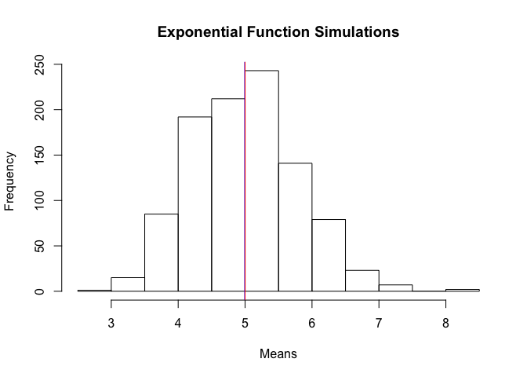
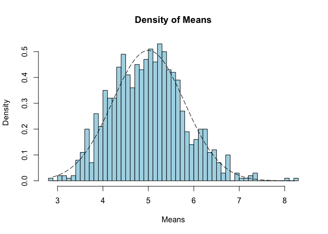
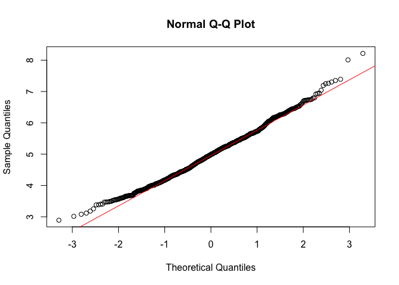

# Statistical Inference: Peer Assessment Part 1

## Requirements

+ Show the sample mean and compare it to the theoretical mean of the distribution.
+ Show how variable the sample is (via variance) and compare it to the theoretical variance of the distribution.
+ Show that the distribution is approximately normal.

## Including Libraries


```r
library("data.table")
library(ggplot2)
```

## Instructions


```r
# set seed for reproducability
set.seed(31)

# Set lambda = 0.2
lambda <- 0.2

# 40 samples
n <- 40

# 1000 simulations
simulations <- 1000

# Simulate
simulated_exponentials <- replicate(simulations, rexp(n, lambda))

# Calculate mean of exponentials
means_exponentials <- apply(simulated_exponentials, 2, mean)
```

## Question 1
Show where the distribution is centered at and compare it to the theoretical center of the distribution.


```r
analytical_mean <- mean(means_exponentials)
analytical_mean
```

```
## [1] 4.993867
```


```r
# analytical mean
theory_mean <- 1/lambda
theory_mean
```

```
## [1] 5
```


```r
# visualization
hist(means_exponentials, xlab = "Means", main = "Exponential Function Simulations")
abline(v = analytical_mean, col = "blue")
abline(v = theory_mean, col = "red")
```

<!-- -->

The analytics mean is 4.993867 while the theoretical mean is 5. The center of distribution of averages of 40 exponentials is very close to the theoretical center of the distribution.

## Question 2
Show how variable it is (via variance) and compare it to the theoretical variance of the distribution.


```r
# Standard deviation of distribution
standard_deviation_dist <- sd(means_exponentials)
standard_deviation_dist
```

```
## [1] 0.7931608
```


```r
# Standard deviation from analytical expression
standard_deviation_theory <- (1/lambda)/sqrt(n)
standard_deviation_theory
```

```
## [1] 0.7905694
```


```r
# Variance of distribution
variance_dist <- standard_deviation_dist^2
variance_dist
```

```
## [1] 0.6291041
```


```r
# Variance from analytical expression
variance_theory <- ((1/lambda)*(1/sqrt(n)))^2
variance_theory
```

```
## [1] 0.625
```

Standard Deviation of the distribution is 0.7931608 with the theoretical SD calculated as 0.7905694. The theoretical variance is calculated as ((1/lambda) * (1/n<sup>0.5</sup>))<sup>2</sup> = 0.625. The actual variance of the distribution is 0.6291041.

## Question 3
Show that the distribution is approximately normal.


```r
xfit <- seq(min(means_exponentials), max(means_exponentials), length = 100)
yfit <- dnorm(xfit, mean = 1/lambda, sd = 1/lambda/sqrt(n))
hist(means_exponentials, breaks = n, prob = T, col = "lightblue", main = "Density of Means", xlab = "Means", ylab = "Density")
lines(xfit, yfit, pch = 22, col = "black", lty = 5)
```

<!-- -->


```r
# Compare the distribution of averages of 40 exponentials to a normal distribution
qqnorm(means_exponentials)
qqline(means_exponentials, col = 2)
```

<!-- -->

Because of the central limit theorem (CLT), the distribution of averages of 40 exponentials is very close to a normal distribution.
