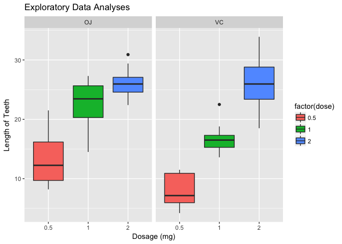

# Statistical Inference: Peer Assessment Part 2

## Requirements

+ Load the ToothGrowth data and perform some basic exploratory data analyses
+ Provide a basic summary of the data.
+ Use confidence intervals and/or hypothesis tests to compare tooth growth by supp and dose. (Only use the techniques from class, even if there's other approaches worth considering)
+ State your conclusions and the assumptions needed for your conclusions.

## Including Libraries

```r
library(ggplot2)
library(datasets)
data(ToothGrowth)
str(ToothGrowth)
```

```
## 'data.frame':	60 obs. of  3 variables:
##  $ len : num  4.2 11.5 7.3 5.8 6.4 10 11.2 11.2 5.2 7 ...
##  $ supp: Factor w/ 2 levels "OJ","VC": 2 2 2 2 2 2 2 2 2 2 ...
##  $ dose: num  0.5 0.5 0.5 0.5 0.5 0.5 0.5 0.5 0.5 0.5 ...
```

```r
head(ToothGrowth)
```

```
##    len supp dose
## 1  4.2   VC  0.5
## 2 11.5   VC  0.5
## 3  7.3   VC  0.5
## 4  5.8   VC  0.5
## 5  6.4   VC  0.5
## 6 10.0   VC  0.5
```
## Question 1
Load the ToothGrowth data and perform some basic exploratory data analyses.


```r
plot <- ggplot(ToothGrowth, 
               aes(x = factor(dose),
               y = len,
               fill = factor(dose)))
               
plot +
geom_boxplot(notch = F) + 
facet_grid(.~supp) +
scale_x_discrete("Dosage (mg)") +   
scale_y_continuous("Length of Teeth") +  
ggtitle("Exploratory Data Analyses")
```

<!-- -->

## Question 2
Provide a basic summary of the data.


```r
ToothGrowth$dose <- as.factor(ToothGrowth$dose)
summary(ToothGrowth)
```

```
##       len        supp     dose   
##  Min.   : 4.20   OJ:30   0.5:20  
##  1st Qu.:13.07   VC:30   1  :20  
##  Median :19.25           2  :20  
##  Mean   :18.81                   
##  3rd Qu.:25.27                   
##  Max.   :33.90
```

```r
table(ToothGrowth$supp, ToothGrowth$dose)
```

```
##     
##      0.5  1  2
##   OJ  10 10 10
##   VC  10 10 10
```

## Question 3
Use confidence intervals and/or hypothesis tests to compare tooth growth by supp and dose. (Only use the techniques from class, even if there's other approaches worth considering)


```r
supp.t1 <- t.test(len~supp, paired=F, var.equal=T, data=ToothGrowth)
supp.t2 <- t.test(len~supp, paired=F, var.equal=F, data=ToothGrowth)
supp.result <- data.frame("p-value" = c(supp.t1$p.value, supp.t2$p.value),
                          "ConfLow" = c(supp.t1$conf[1],supp.t2$conf[1]),
                          "Conf-High" = c(supp.t1$conf[2],supp.t2$conf[2]),
                          row.names = c("Equal Var","Unequal Var"))
supp.result
```

```
##                p.value    ConfLow Conf.High
## Equal Var   0.06039337 -0.1670064  7.567006
## Unequal Var 0.06063451 -0.1710156  7.571016
```

## Question 4
State your conclusions and the assumptions needed for your conclusions.

Based on the analysis above, our conclusions are as follows: 

- The 2mg dose has larger impact on tooth growth than 1mg and 0.5mg, while 1mg dose has more impact than 0.5mg dose. So there is a different in the growth of the tooth while the doses are larger.
- Orange juice and vitamin C have obvious different impact on tooth growth.
