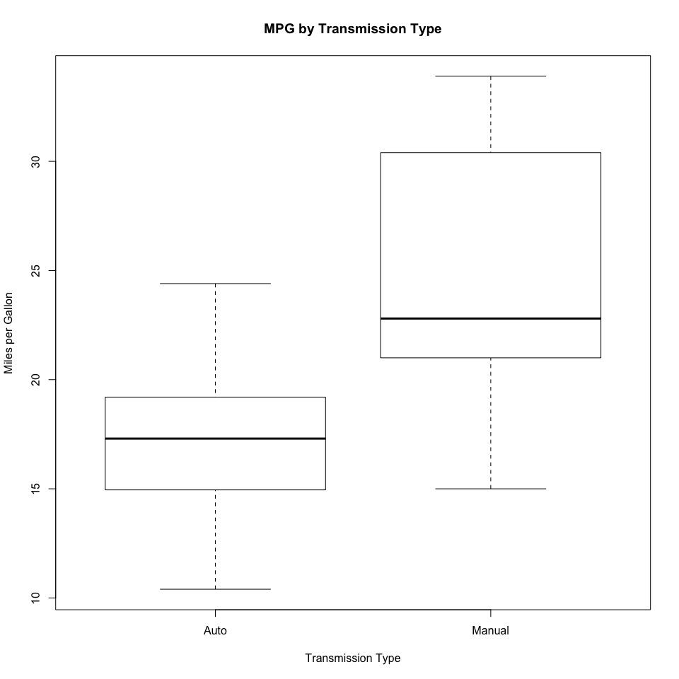
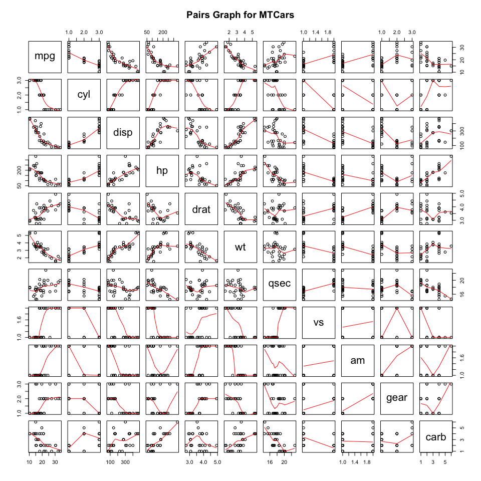
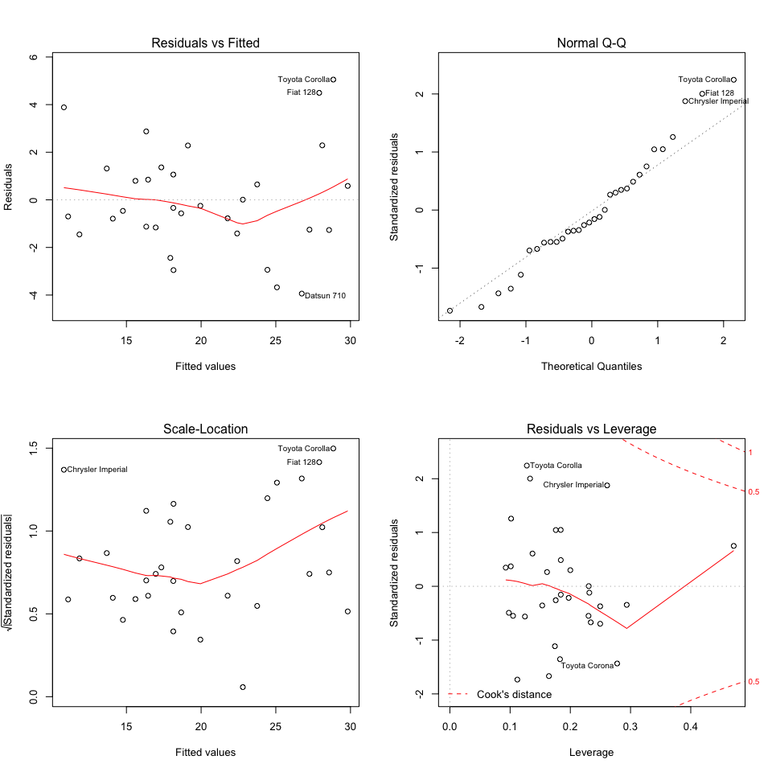

# Regression Models: Peer Assessment
    
## Executive Summary
    
The report will do some study to obtain whether an automatic or manual transmission is better for MPG. We used the dataset `mtcars` which is from the 1974 Motor Trend US magazine, and ran a statistical test and a regression analysis. On one hand, the statistical test shows a difference in mean of about 7 miles more for the manual transmitted cars. On the other hand, the regression analysis indicates that manual transmitted cars are only 1.8 miles better than automatic transmitted cars if taking into account other variables like horse power and weight, but this result is not significant. So to get a better mileage, it's probably better to consider cars of a certain weight and horse power than to consider manual or automatic transmission.

## Data Preprocessing

Data loading and summary.


```r
data(mtcars)
str(mtcars)
```

```
## 'data.frame':	32 obs. of  11 variables:
##  $ mpg : num  21 21 22.8 21.4 18.7 18.1 14.3 24.4 22.8 19.2 ...
##  $ cyl : num  6 6 4 6 8 6 8 4 4 6 ...
##  $ disp: num  160 160 108 258 360 ...
##  $ hp  : num  110 110 93 110 175 105 245 62 95 123 ...
##  $ drat: num  3.9 3.9 3.85 3.08 3.15 2.76 3.21 3.69 3.92 3.92 ...
##  $ wt  : num  2.62 2.88 2.32 3.21 3.44 ...
##  $ qsec: num  16.5 17 18.6 19.4 17 ...
##  $ vs  : num  0 0 1 1 0 1 0 1 1 1 ...
##  $ am  : num  1 1 1 0 0 0 0 0 0 0 ...
##  $ gear: num  4 4 4 3 3 3 3 4 4 4 ...
##  $ carb: num  4 4 1 1 2 1 4 2 2 4 ...
```

```r
head(mtcars)
```

```
##                    mpg cyl disp  hp drat    wt  qsec vs am gear carb
## Mazda RX4         21.0   6  160 110 3.90 2.620 16.46  0  1    4    4
## Mazda RX4 Wag     21.0   6  160 110 3.90 2.875 17.02  0  1    4    4
## Datsun 710        22.8   4  108  93 3.85 2.320 18.61  1  1    4    1
## Hornet 4 Drive    21.4   6  258 110 3.08 3.215 19.44  1  0    3    1
## Hornet Sportabout 18.7   8  360 175 3.15 3.440 17.02  0  0    3    2
## Valiant           18.1   6  225 105 2.76 3.460 20.22  1  0    3    1
```

Convert "cyl", "vs", "gear", "carb" and "am" variables to factor variables.


```r
mtcars$cyl <- factor(mtcars$cyl)
mtcars$vs <- factor(mtcars$vs)
mtcars$gear <- factor(mtcars$gear)
mtcars$carb <- factor(mtcars$carb)
mtcars$am <- factor(mtcars$am)
```

Rename the levels of the "am" variable to "Auto" and "Manual".


```r
levels(mtcars$am) <- c("Auto", "Manual")
```

## Graphics

We begin with plotting boxplots of the variable "mpg" when "am" is "Auto" or "Manual" (Figure 1 in the appendix). This plot hints at an increase in "mpg" when gearing was manual but this data may have other variables which may play a bigger role in determination of "mpg".

We then plot the relationships between all the variables of the dataset (Figure 2 in the appendix). We may note that variables like "cyl", "disp", "hp", "drat", "wt", "vs" and "am" seem highly correlated to "mpg".

## Inference

Conduct t-test to compare the mpg means between automatic and manual transmissions.

### T-test

Use a t-test assuming that the mileage data has a normal distribution.


```r
t.test(mpg ~ am, data = mtcars)
```

```
## 
## 	Welch Two Sample t-test
## 
## data:  mpg by am
## t = -3.7671, df = 18.332, p-value = 0.001374
## alternative hypothesis: true difference in means is not equal to 0
## 95 percent confidence interval:
##  -11.280194  -3.209684
## sample estimates:
##   mean in group Auto mean in group Manual 
##             17.14737             24.39231
```

The test results clearly shows that the manual and automatic transmissions are significantly different.

## Regression Analysis

Use the Akaike Information Criteria (AIC) in a stepwise algorithm. This algorithm does not evaluate the AIC for all possible models but uses a search method that compares models sequentially. Thus it bears some comparison to the classical stepwise method but with the advantage that no dubious p-values are used.


```r
model.all <- lm(mpg ~ ., data = mtcars)
model <- step(model.all)
```


```r
summary(model)
```

```
## 
## Call:
## lm(formula = mpg ~ cyl + hp + wt + am, data = mtcars)
## 
## Residuals:
##     Min      1Q  Median      3Q     Max 
## -3.9387 -1.2560 -0.4013  1.1253  5.0513 
## 
## Coefficients:
##             Estimate Std. Error t value Pr(>|t|)    
## (Intercept) 33.70832    2.60489  12.940 7.73e-13 ***
## cyl6        -3.03134    1.40728  -2.154  0.04068 *  
## cyl8        -2.16368    2.28425  -0.947  0.35225    
## hp          -0.03211    0.01369  -2.345  0.02693 *  
## wt          -2.49683    0.88559  -2.819  0.00908 ** 
## amManual     1.80921    1.39630   1.296  0.20646    
## ---
## Signif. codes:  0 '***' 0.001 '**' 0.01 '*' 0.05 '.' 0.1 ' ' 1
## 
## Residual standard error: 2.41 on 26 degrees of freedom
## Multiple R-squared:  0.8659,	Adjusted R-squared:  0.8401 
## F-statistic: 33.57 on 5 and 26 DF,  p-value: 1.506e-10
```

The AIC algorithm tells us to consider "cyl", "wt" and "hp" as confounding variables. The individual p-values allows us to reject the hypothesis that the coefficients are null. The adjusted r-squared is 0.8400875, so we may draw the conclusion that more than 84% of the variation is explained by the model.


```r
model0 <- lm(mpg ~ am, data = mtcars)
anova(model0, model)
```

```
## Analysis of Variance Table
## 
## Model 1: mpg ~ am
## Model 2: mpg ~ cyl + hp + wt + am
##   Res.Df    RSS Df Sum of Sq      F    Pr(>F)    
## 1     30 720.90                                  
## 2     26 151.03  4    569.87 24.527 1.688e-08 ***
## ---
## Signif. codes:  0 '***' 0.001 '**' 0.01 '*' 0.05 '.' 0.1 ' ' 1
```

We may notice that when we compare the model with only "am" as independant variable and our chosen model, we reject the null hypothesis that the variables "cyl", "hp" and "wt" don't contribute to the accuracy of the model.

The regression suggests that, other variables remaining constant, manual transmitted cars can drive 1.8092114 more miles per gallon than automatic transmitted cars, and the results are not statistically significant.

## Residuals and Diagnostics

### Residual Analysis

According to the residual plots (Figure 3 in the appendix), we can verify some assumptions made before.

+ The Residuals vs Fitted plot seem to verify the independance assumption as the points are randomly scattered on the plot.
+ The Normal Q-Q plot seem to indicate that the residuals are normally distributed as the points hug the line closely.
+ The Scale-Location plot seem to verify the constant variance assumption as the points fall in a constant band.

### Leverages

We begin by computing the leverages for the `mtcars` dataset.


```r
leverage <- hatvalues(model)
```

We use a hatvalue > 0.5 to find the outliers out of the observations in the dataset.


```r
leverage[which(leverage > 0.5)]
```

```
## named numeric(0)
```

## Appendix

### Figure 1 : Boxplots of "mpg" vs "am"


```r
plot(mpg ~ am, data = mtcars, main = "MPG by Transmission Type", xlab = "Transmission Type", ylab = "Miles per Gallon")
```

<!-- -->

### Figure 2 : Pairs Graph


```r
pairs(mtcars, panel = panel.smooth, main = "Pairs Graph for MTCars")
```

<!-- -->

### Figure 3 : Residual Plots


```r
par(mfrow = c(2, 2))
plot(model)
```

<!-- -->
