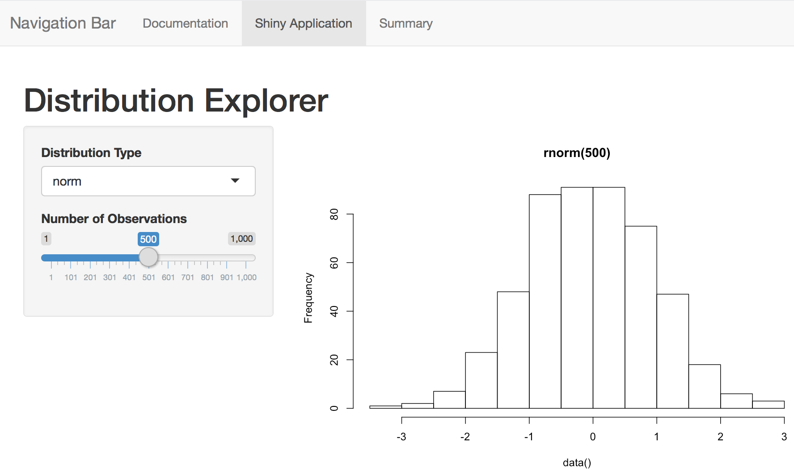

Shiny Application and Reproducible Pitch
========================================================
author: Theo
date: 9/24/2017
autosize: true

Instructions
========================================================

Goal of this Shiny application
---

Simulate different distributions.

Instructions
---

### In the "Shiny Application" menu of the Navigation Bar
+ Just choose a distribution type and input a number of observations.
+ The graph of the simulated distribution dynamically updates.

### In the "Summary" menu of the Navigation Bar
Main details of the simulated distribution are shown:

+ __Min.__ : Minimum value
+ __1st Qu.__ : Value of the first quantile
+ __Median__ : Median value
+ __Mean__ : Mean value
+ __3rd Qu.__ : Value of the third quantile
+ __Max.__ : Maximum value

ui.R
========================================================

```
library(shiny)
require(markdown)

shinyUI(navbarPage("Navigation Bar",
                   tabPanel("Documentation",
                            includeMarkdown("documentation.md")
                   ),
                   tabPanel("Shiny Application",
                            pageWithSidebar(
                                headerPanel("Distribution Explorer"),
                                sidebarPanel(
                                    selectInput('dist', 'Distribution Type',
                                                c("norm", "unif", "lnorm", "exp")
                                    ),
                                    sliderInput('n', 'Number of Observations', 
                                                value = 500, min = 1, max = 1e3, step = 1
                                    )
                                ),
                                mainPanel(
                                    plotOutput('plot')
                                )
                            )
                   ),
                   tabPanel("Summary", 
                            verbatimTextOutput("summary")
                   )
))
```

server.R
========================================================

```
library(shiny)
library(ggplot2)

# Define server logic for random distribution application
shinyServer(function(input, output) {
    
    # Reactive expression to generate the requested distribution. This is 
    # called whenever the inputs change. The output renderers defined 
    # below then all used the value computed from this expression
    data <- reactive({  
        dist <- switch(input$dist,
                       norm = rnorm,
                       unif = runif,
                       lnorm = rlnorm,
                       exp = rexp,
                       rnorm)
        
        dist(input$n)
    })
    
    # Generate a plot of the data. Also use the inputs to build the plot label. 
    # Note that the dependencies on both the inputs and the data reactive expression 
    # are both tracked, and all expressions are called in the sequence implied
    # by the dependency graph
    output$plot <- renderPlot({
        dist <- input$dist
        n <- input$n
        
        hist(data(), 
             main = paste('r', dist, '(', n, ')', sep = ''))
    })
    
    output$summary <- renderPrint({
        summary(data())
    })        
})
```

Output
========================================================


